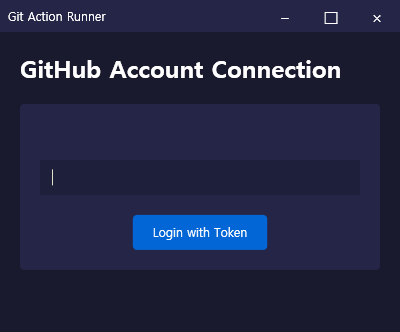
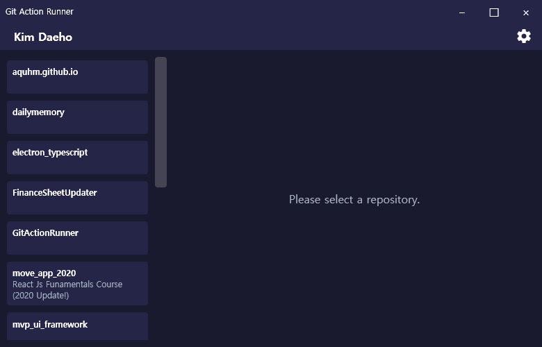
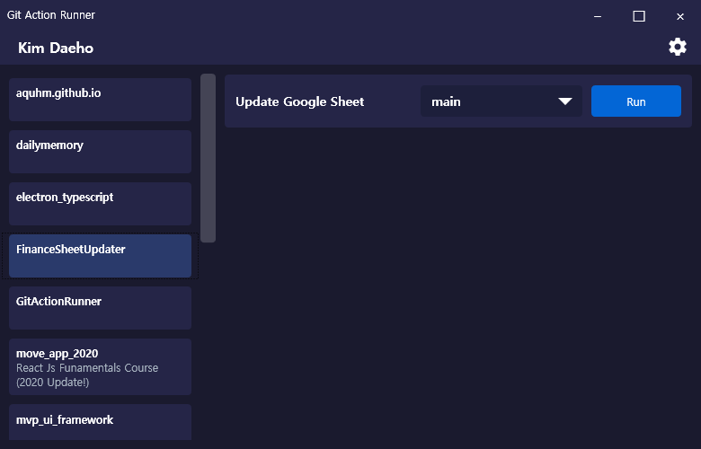

# Git Action Runner


Windows 데스크톱 환경에서 GitHub Actions 워크플로우를 관리하는 GUI 애플리케이션입니다.  
개발자 친화적인 인터페이스로 복잡한 CI/CD 파이프라인을 손쉽게 제어할 수 있습니다.

## ✨ 주요 기능
- **GitHub 계정 통합** - Personal Access Token 기반 원클릭 인증
- **실시간 모니터링** - 워크플로우 실행 상태 시각화
- **브랜치 관리** - 리포지토리 브랜치별 작업 분리 운영
- **보안 강화** - Windows DPAPI 기반 토큰 암호화
- **다크 테마** - 장시간 사용 시 눈 피로도 최소화

## 📦 의존성
```xml
<PackageReference Include="CommunityToolkit.Mvvm" Version="8.2.2"/>
<PackageReference Include="Microsoft.Extensions.DependencyInjection" Version="8.0.0"/>
<PackageReference Include="Octokit" Version="9.1.0"/>
<PackageReference Include="Serilog" Version="3.1.1"/>
<PackageReference Include="Serilog.Sinks.Console" Version="5.0.1"/>
<PackageReference Include="Serilog.Sinks.File" Version="5.0.0"/>
```


## 🏗️ 프로젝트 구조
```
GitActionRunner/
├── Core/                 # 비즈니스 로직 레이어
│   ├── Interfaces/      # 서비스 계약 정의
│   ├── Models/          # 도메인 모델
│   └── Services/        # GitHub API 연동 구현
├── ViewModels/          # MVVM 패턴 구현
├── Views/               # WPF XAML 리소스
├── Controls/            # 재사용 UI 컴포넌트
├── Converters/          # 데이터 바인딩 변환기
└── Services/            # 애플리케이션 서비스

```




