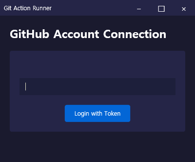
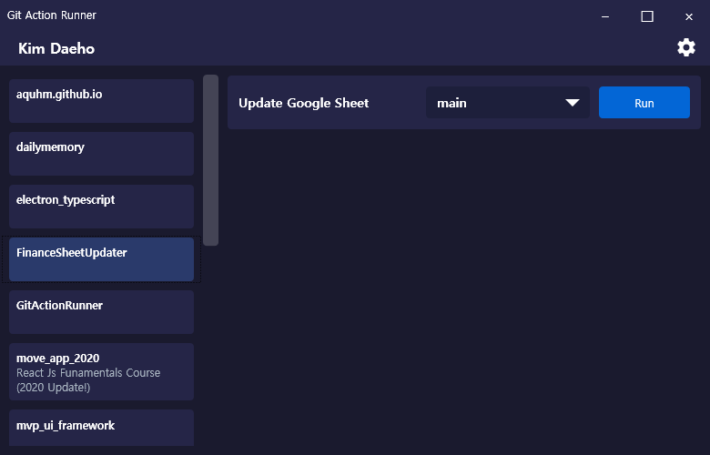

# Git Action Runner


Windows 데스크톱 환경에서 GitHub Actions 워크플로우를 관리하는 GUI 애플리케이션입니다.  
개발자 친화적인 인터페이스로 복잡한 CI/CD 파이프라인을 손쉽게 제어할 수 있습니다.

## ✨ 주요 기능
- **GitHub 계정 통합** - Personal Access Token 기반 원클릭 인증으로 안전하고 편리한 GitHub 계정 연동
- **실시간 모니터링** - 워크플로우 실행 상태 실시간 추적 및 시각화, Windows 네이티브 알림 지원
- **브랜치 관리** - 리포지토리별 브랜치 선택 및 워크플로우 실행, 상세한 실행 이력 조회
- **인터페이스 최적화** - 직관적인 UI/UX 설계와 다크 테마 지원으로 사용자 편의성 극대화
- **상태 관리** - 워크플로우 실행 상태(성공/실패/진행 중)에 따른 시각적 피드백 제공


## 📦 의존성
```xml
<!-- UI 및 MVVM -->
<PackageReference Include="CommunityToolkit.Mvvm" Version="8.2.2"/>
<PackageReference Include="ReactiveUI.WPF" Version="20.1.63" />

<!-- 의존성 주입 -->
<PackageReference Include="Microsoft.Extensions.DependencyInjection" Version="8.0.0"/>
<PackageReference Include="Microsoft.Extensions.Configuration" Version="8.0.0"/>

<!-- GitHub API -->
<PackageReference Include="Octokit" Version="9.1.0"/>

<!-- 알림 시스템 -->
<PackageReference Include="DesktopNotifications" Version="1.3.1" />
<PackageReference Include="DesktopNotifications.Windows" Version="1.3.1" />
<PackageReference Include="Microsoft.Toolkit.Uwp.Notifications" Version="7.1.3" />

<!-- 로깅 -->
<PackageReference Include="Serilog" Version="3.1.1"/>
<PackageReference Include="Serilog.Sinks.Console" Version="5.0.1"/>
<PackageReference Include="Serilog.Sinks.File" Version="5.0.0"/>
```

## 🛠️ 기술 스택
- **.NET 9.0**: 최신 .NET 프레임워크 기반의 안정적인 실행 환경
- **WPF**: 풍부한 데스크톱 UI 구현을 위한 프레젠테이션 프레임워크
- **MVVM Pattern**: CommunityToolkit.Mvvm을 활용한 클린 아키텍처 구현
- **GitHub API**: Octokit.NET을 통한 효율적인 GitHub 통합
- **Reactive Extensions**: ReactiveUI로 반응형 프로그래밍 패러다임 적용
- **Windows 네이티브 알림**: DesktopNotifications로 OS 수준의 사용자 알림 통합

## 🏗️ 프로젝트 구조
```
GitActionRunner/
├── Core/                 # 비즈니스 로직 레이어
│   ├── Interfaces/      # 서비스 계약 정의
│   │   ├── IAuthenticationService.cs    # 인증 서비스 인터페이스
│   │   ├── IGitHubService.cs           # GitHub API 서비스 인터페이스
│   │   └── ISecureStorage.cs           # 보안 저장소 인터페이스
│   ├── Models/          # 도메인 모델
│   │   ├── Repository.cs               # 리포지토리 모델
│   │   └── WorkflowRun.cs             # 워크플로우 실행 모델
│   └── Services/        # 핵심 서비스 구현
│       ├── GitHubService.cs           # GitHub API 통합
│       └── NotificationService.cs      # 알림 서비스
├── ViewModels/          # MVVM 아키텍처
│   ├── GitHubLoginViewModel.cs        # 로그인 화면 로직
│   └── RepositoryListViewModel.cs      # 저장소 목록 로직
├── Views/               # UI 레이어
├── Controls/            # 커스텀 컨트롤
├── Converters/          # 값 변환기
└── Services/            # 인프라 서비스
```

## 📱 스크린샷
### 로그인 화면

GitHub Personal Access Token을 통한 안전한 인증

### 리포지토리 목록

사용자 리포지토리 목록 및 워크플로우 상태 확인

### 워크플로우 실행

브랜치 선택 및 워크플로우 실행 관리

### 실행 이력

워크플로우 실행 이력 및 상태 모니터링

### 알림 시스템

Windows 네이티브 알림을 통한 실시간 상태 업데이트

## 🚀 시작하기
1. GitHub Personal Access Token 발급 (필요 권한: `repo`, `workflow`)
2. 애플리케이션 실행 및 토큰 입력
3. 리포지토리 선택 후 워크플로우 관리 시작

## 📝 라이선스
이 프로젝트는 MIT 라이선스를 따릅니다.